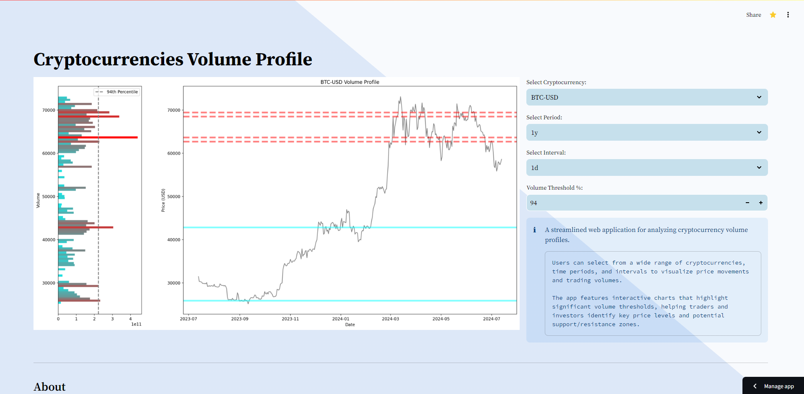

### Crypto Volume Profile App
---

The Crypto Volume Profile App is a streamlined web application designed for analyzing cryptocurrency volume profiles. It allows users to visualize price movements and trading volumes for a wide range of cryptocurrencies over different time periods and intervals.

#### Key Features:

- **Cryptocurrency Selection**: Users can choose from a variety of cryptocurrencies listed in a Yahoo.

- **Customizable Time Periods and Intervals**: The app offers flexibility in selecting the period (e.g., 1 year, 6 months, 2 years) and interval (e.g., daily, hourly) for the analysis.

- **Volume Profile Visualization**: The app processes historical price and volume data to create a volume profile. This profile helps identify key price levels where significant trading volumes occurred.
- **Threshold Highlighting**: Users can set a volume threshold percentage to highlight significant volume levels on the price chart. This helps in identifying potential support and resistance zones.

- **Interactive Charts**: The app features interactive charts that dynamically update based on user input, providing an intuitive way to analyze market data.

- **Color-Coded Indicators**: The volume profile is visualized with a gradient color map, where different colors indicate varying volume levels. Horizontal lines on the price chart are color-coded to show whether the current price is above or below significant volume levels.

#### How It Works:

1. **Data Fetching**: The app fetches historical price and volume data from Yahoo Finance based on user-selected options.
   
2. **Volume Profile Calculation**: The app processes the data to create a volume profile, binning the price data and weighting it by volume.

3. **Threshold Application**: A user-defined threshold is applied to highlight significant volume levels on the price chart.

4. **Plotting**: The app generates two main plots:
   - A price chart with highlighted volume thresholds.
   - A horizontal bar chart showing the volume profile.

5. **Interactive Elements**: The app includes interactive elements such as dropdown menus for cryptocurrency selection and sliders for setting volume thresholds.

#### About

The Crypto Volume Profile App is developed for informational purposes only. It is not financial advice and should not be considered as such. For more information, please visit the developer's profiles and contact points:

